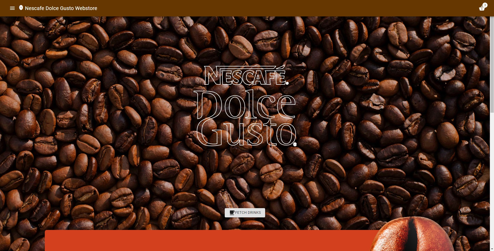

# Final Project

# Nescfe Dolce Gusto Webstore

## Quickstart

To launch the project, follow these steps:

* Open a command prompt in the root of the project
* Install all requirements: `pip install -r requirements.txt`
* Make sure the database is up-to-date by running `python manage.py migrate`
* Load the fixture (that includes 200 entities) running `python manage.py loaddata data`
* Start the server running `python manage.py runserver`
* Open a second prompt in the subfolder of the project: `./webstore/webstore-front` (navigate to this folder using `cd`)
* Install the Front-End dependencies running `npm install`
* Run the Front-End running `npm start`

:warning: If the URL or PORT of your server is not `localhost:8000`, update the `BACK_END_URL` variable in `./webstore/webstore-front/services/network.service.js`.

## Functionalities

Users can:

* Fetch products by categories
* Read product details
* Add product (including a packaging and/or color of the product - called ProductType) to their cart
* Consult cart, modify quantity of an item
* Order a cart, receiving an email with their order details

Administrators can:

* Manage and add products, as well as their types and categories
* View and edit orders

## Technologies

The project is developed around an API: The Front-End part request information from the Back-End.

### Back-End

The Back-End part is developed using Django. It uses a SQLite database.

| Requirement         	| Description                                          	|
|---------------------	|------------------------------------------------------	|
| Django              	| Python Framework                                     	|
| django-cors-headers 	| Permits to create an API and authorize CORS requests 	|

### Front-End

The Front-End part is developed using React and Material UI.

| Dependency         	| Description                                  	|
|--------------------	|----------------------------------------------	|
| React              	| [React](https://reactjs.org/) is a JavaScript Framework                         	|
| react-dom          	| DOM entry point for React                   	|
| react-scripts      	| Scripts and configuration of React           	|
| react-router-dom   	| Router for React                             	|
| @material-ui/core  	| [Material UI](https://material-ui.com/) is a Front-End library for React 	|
| @material-ui/icons 	| [Icons](https://material-ui.com/components/material-icons/) that goes with Material UI library     	|

## Code explanation and features

### Cart

The cart is only stored client-side, in the localStorage, following the format:
`{productTypeId: quantity}`.

For example, the cart `{"80": 1}` means that th cart contains the productType with id = 80, with 1 as quantity.

### User

The project does not need user sessions: Customers can place orders and reeive an email for each placed order: they do not need to see past orders directly in the project.

### API Protocol & Endpoints

| Endpoint name 	| URL 	| Method 	| Description 	| Parameters 	| Response example  |
|--------------------------	|--------------------------	|--------	|--------------------------------------------------	|----------------------------------------------------------------------------------------------------------------	|-----------------------------------------------------------------------------------------------------------------------------------------------------------------------------------------------------------------------------------------------------------------------------------------------------------------------------------------------------------------------------------------------------------------------	|
 | getAllCategories 	| `/categories` 	| GET    	| Get the list of all categories 	| 	| `[{"id": 1, "label": "Espresso Coffees", "isDrinkCategory": true}]`   	|
| getCategoryDetails       	| `/category/:category_id` 	| GET    	| Get one category details, including its products 	| `category_id`: The category id (mandatory) 	| `{"id": 1, "label": "Espresso Coffees", "isDrinkCategory": true,  "products": [{"id": 1, "name": "Espresso Barista", "description": "One of our most intense coffee...",  "shortDescription": "Dark and aromatic...", "type": null, "color": "#7E7E7E", "isLightColor": false,  "typeColor": null, "indicator": 1}]}` 	| | getProductDetails  	| `/product/:product_id`   	| GET  	| Get one product details, including its types     	| `product_id`: The product id (mandatory) 	| `{"id": 1, "name": "Espresso Barista", "description": "One of our most intense coffee...",  "shortDescription": "Dark and aromatic...", "type": null, "color": "#7E7E7E", "isLightColor": false,  "typeColor": null, "indicator": 1, "category": {"id": 1, "label": "Espresso Coffees", "isDrinkCategory": true},  "types": [{"id": 1, "number": 16, "price": "4.59", "color": null, "name": null}]}`  	| | getProductTypesViaIdList 	| `/producttype`           	| GET    	| Get one or more productType details   	| `id` (as GET parameter): The id to retrieve 	| `{"1": {"id": 1, "number": 16, "price": "4.59", "color": null, "name": null, "product": {"id": 1,  "name": "Espresso Barista", "description": "One of our most intense coffee...",  "shortDescription": "Dark and aromatic...", "type": null, "color": "#7E7E7E", "isLightColor": false,  "typeColor": null, "indicator": 1, "category": {"id": 1, "label": "Espresso Coffees", "isDrinkCategory": true}}}}` 	| | order  	| `/order` | POST   	| Order a cart   	| Request body, containing following parameters: fullname, email, address, postalCode, city, country and cart 	| `{"orderId": 2}`|

:warning: The CSRF protection, defaultly provided by Django, is disabled on the `/order` endpoint.

The reason for that is that Django is used here as an API, so the CSRF can't be a secure way to handle this endpoint. As explained in the code, the other way around is to create an endpoint that will return a CSRF token, but this is counter-productive,
as any potential hacker can use this endpoint to get a valid CSRF token.

To secure that endpoint (and all others at the same time), we need to ensure our CORS policy is adequate.

### Database Structure

| Model 	| Description 	| Fields 	|
|-------------	|---------------------------------------------------	|----------------------------------------------------------------------------------------------------------------------------------------------------------------------------------------------------------------------------------------------------------------------------------------------------------------------------------------------------------------------------------------------------------------------------------------------------------	|
| Category 	| A product category 	| Label: The category title isDrinkCategory: Is the category for drinks or other products (like coffee machines) 	|
| Product 	| The product class 	| name: The product name shortDescription: one sentence-long description description: Full-length description type: The type of beverage, if applicable color: main color of the product isLightColor: tell to print text on top of this color in light      or dark for better contrast typeColor: Color of the beverage type, is applicable indicator: Water indicator of the pod, if applicable category: product's category 	|
| ProductType 	| Packaging of the product or color 	| number: Number of pods, if applicable product: type's product price: Price of this packaging color: Color of the product, if applicable name: Name of this packaging, if applicable 	|
| Order 	| Represents details of an order 	| fullname: Customer name address: Customer address, containing address,      postalCode, city and country email: Customer e-mail address sum: Sum of product prices, at the moment of the order     Used to fix the order's price (so if a price is updated     by an admin, order's price stays the same) 	|
| OrderLine 	| Line of an order (Links the order and product) 	| order: line's order productType: product of the line quantity: quantity of the specified product 	|

### Custom Font

A custom font is used in this project and can be found under `./webstore/webstore-front/src/resources/custom-font`.

The goal of this project is to transform all SVG files from `./original/processed` to a font genreated using Webpack and loaders generated into the `./dist` folder.

This font is imported in the `./src/index.js` file to be used in the project.

### Custom Theme

The MaterialUI library comes with a theme tool built-in.

This project comes with a theme configuration (in the `<App/>` component) that provides two themes: brown on white, and white on brown.

 Brown color

In addition to that, an orange color is used only on the splash screen, and some other util CSS, provided via CSS variables (in `./styles.scss`).

### Admin panel

The Django admin panel can be found at `localhost:8000/admin`.

It was modified to provide additional functionalities:
* edit associated products inside the category edit form
* edit associated productTypes inside the product edit form
* edit orderLines inside the order edit form

### Front-End Architecture

| Directory 	| Description 	|
|-------------	|------------------------------------------------------------	|
| /components 	| React components that compose the app Each comes with a JS file and style file 	|
| /resources 	| Diverses resources, including the custom font and pictures 	|
| /services 	| App services (Services are written in plain JS) 	|
| index.js 	| App entry point 	|
| styles.scss 	| App-wide styles 	|

| Component 	| Url 	| Description 	|
|---------------------	|------------------------	|------------------------------------------------------------------------------------------------	|
| App 	|  	| Root component, with the navbar and the router 	|
| Cart 	| /cart 	| Cart component, that prints the cart lines 	|
| Category 	| /category/:category_id 	| Category component, that prints category and its products 	|
| Checkout 	| /checkout 	| Checkout component, that prints future order details, and ask for user's details 	|
| CheckoutSuccess 	| /checkoutsuccess 	| CheckoutSuccess component, that prints order details when an order is complete 	|
| ComponentSafeUpdate 	|  	| ComponentSafeUpdate is a util component to manage React state 	|
| Pod 	|  	| Pod is a util component that prints the top of the corresponding pod from product's details 	|
| Product 	| /product/:product_id 	| Product Component, that prints product's details 	|
| Splash 	| / 	| Splash screen component 	|

| Service 	| Description 	| Methods 	|
|----------------------------------------	|---------------------------------------	|--------------------------------------------------------------------------------------------------------------------------------------------------------------------------------------------------------------------------------------------------------------------------------------------------------------------------------------------------------------------------------------------------------------------------------------------------------------------------------------------------------------------------------------------------------------------------------------------------------------------------------------------------------------------------	|
| CartService `cart.service.js` 	| Service to manage cart 	| `isCartExist`: is cart exist in localStorage `hasProductType`: has cart already the productType `getCart`: get cart content from localStorage `__setCart`: set the cart content `emptyCart`: set the cart content to be empty `getLoadedCart`: get Cart content from localStorage,  along with productTypes from the Back-End `addItem`: add item to the cart `modifyQuantity`: modify quantity of a cart item `deleteProduct`: delete a product from the cart `notifyObservers`: notify all observers when the  cart is updated `addObserver`: add a new observer to the list `removeObserver`: remove observer from the list 	|
| MessageService `message.service.js` 	| Service to print message to the user 	| `addObserver`: add a new observer to the list `removeObserver`: remove observer from the list `printMessage`: notify all observers when a new message has to be printed 	|
| NetworkService `network.service.js` 	| Service to interact with the Back-End 	| `getAllCategories`: fetch all categories `getCategoryDetails`: get one category details,  along with its products `getProductDetails`: get one product details, along with its types `getProductTypes`: get one or multiple productTypes `order`: send a cart and user details to place an order 	|

CartService and MessageService both use the observer pattern.

### Autocomplete

Autocomplete has been activated inside the checkout form, following HTML Specifications from [here](https://html.spec.whatwg.org/multipage/form-control-infrastructure.html#autofilling-form-controls:-the-autocomplete-attribute). I added an [autofill hint set](https://html.spec.whatwg.org/multipage/form-control-infrastructure.html#autofill-processing-model) to get a shipping address from the autocomplete.

| Field 	| Autocomplete 	| Description from HTML Specifications 	|
|---------------------------	|---------------------------	|--------------------------------------------------------------------------------------------------------------------------------------------------------------------------------------------------------------------------------------------------------------	|
| Fullname 	| `name` 	| Full name 	|
| Email address 	| `email` 	| E-mail address 	|
| Address (number + street) 	| `shipping street-address` 	| Street address (multiple lines, newlines preserved) 	|
| Postal Code 	| `shipping postal-code` 	| Postal code, post code, ZIP code, CEDEX code 	|
| City 	| `shipping address-level2` 	| The administrative level, in addresses with two or more administrative levels;  in the countries with two administrative levels, this would typically be the city,  town, village, or other locality within which the relevant street address is found 	|
| Country 	| `shipping country-name` 	| Country name 	|

## Copyrights

All pictures and logos are property of their respective owners.

Particularly, the 'Nescafe Dolce Gusto' logo, coffee pods and boxes designs, as well as Coffee photography are property of Nestle/Nescafe.

The coffee bean and coffee powder, inserted as illustrations in the splash/welcome screen, are also property of Nestle/Nescafe.

The coffee beans background, is a royalty-free (for commercial reuse) found on unsplash.com [here](https://unsplash.com/photos/TD4DBagg2wE).

All icons are either royalty-free icons modified and optimized by me, or handmade icons (such as the pod icon).

Apart from that and code present in libraries (such as inside `node_modules` directories), I developed every line of code.
